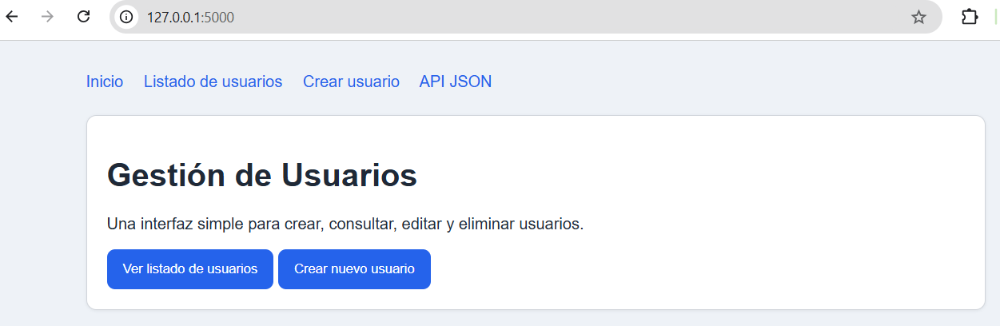
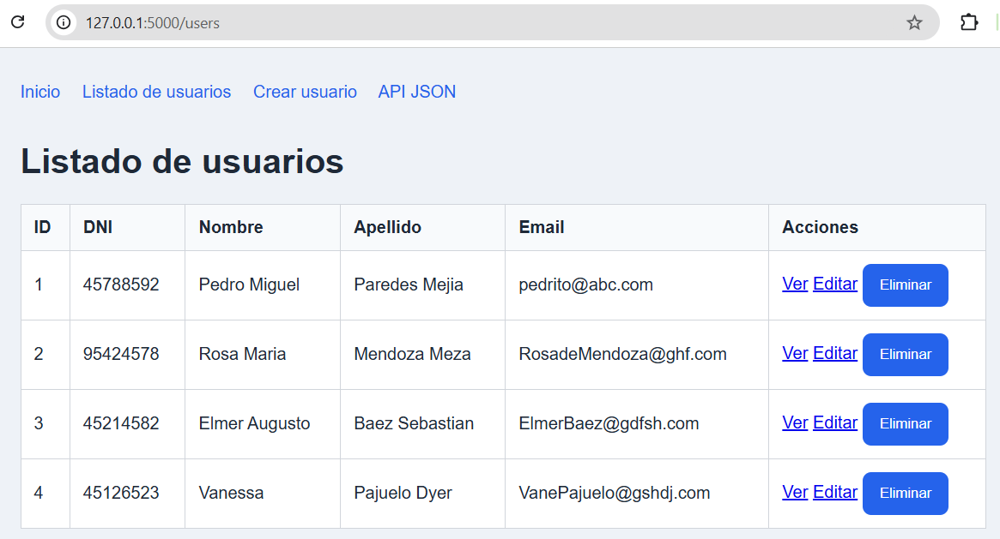
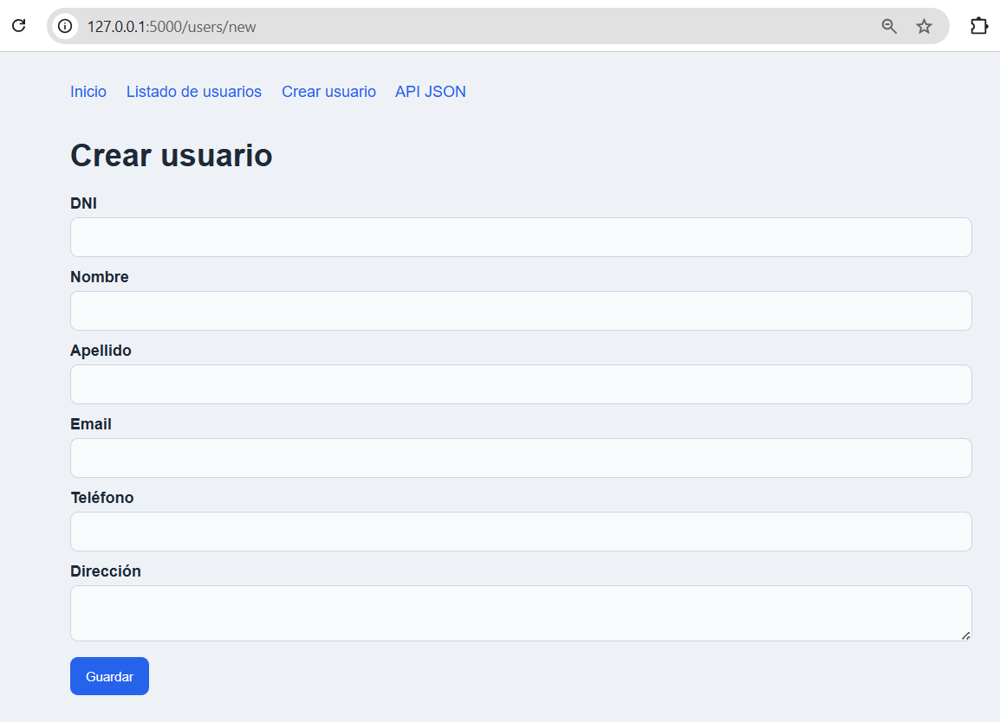
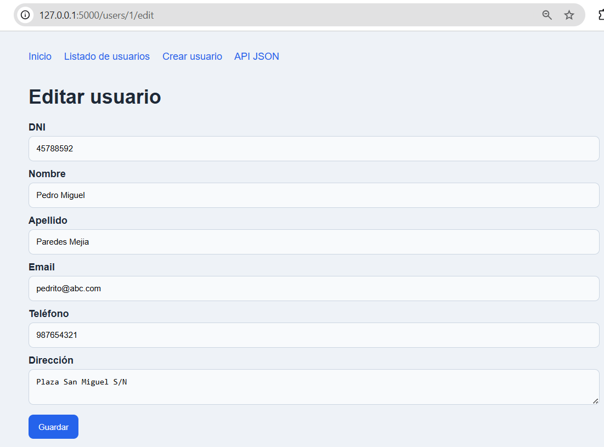
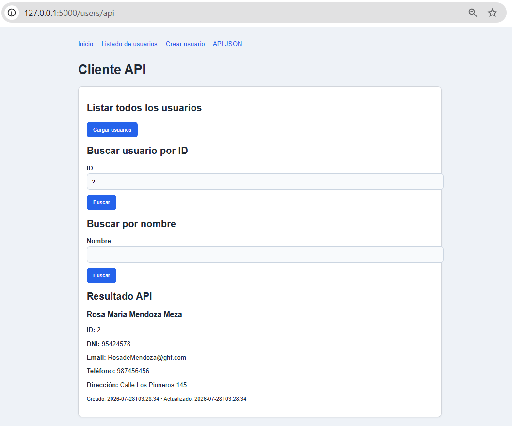

# Tarea01_Flask_CE

Aplicación web desarrollada con **Python** y **Flask** que implementa un **CRUD completo de usuarios** y una **API REST** utilizando **SQLite** como base de datos.

---

# Descripción del proyecto

Esta aplicación fue desarrollada como parte de la Tarea 01 del curso de Flask.

El objetivo es aplicar buenas prácticas de desarrollo web utilizando:

- Python y Flask
- SQLite como base de datos
- SQLAlchemy como ORM
- Arquitectura modular
- Control de versiones con Git y GitHub
- Variables de entorno mediante `.env`

La aplicación permite administrar usuarios mediante operaciones CRUD (Crear, Consultar, Actualizar y Eliminar) y expone endpoints que devuelven información en formato JSON.

---

# Cómo instalar las dependencias

## Opción recomendada (UV)

Instalar todas las dependencias del proyecto:

```powershell
uv sync
```

## Instalación manual

Crear el entorno virtual:

```powershell
python -m venv .venv
```

Activar el entorno virtual:

```powershell
.venv\Scripts\Activate.ps1
```

Instalar las dependencias:

```powershell
pip install -r requirements.txt
```

---

# Cómo crear el entorno virtual con UV

Si aún no tienes UV instalado:

```powershell
pip install uv
```

Crear el entorno virtual:

```powershell
uv venv
```

Sincronizar las dependencias:

```powershell
uv sync
```

---

# Cómo ejecutar el proyecto

Crear el archivo de configuración:

```powershell
copy .env.sample .env
```

Editar las variables necesarias en `.env`.

Ejecutar la aplicación:

```powershell
uv run python main.py
```

Abrir el navegador en:

```
http://127.0.0.1:5000
```

---

# Capturas de pantalla del funcionamiento

## Página principal



## Lista de usuarios



## Crear usuario



## Editar usuario



## API JSON



---

# Explicación breve de la arquitectura utilizada

El proyecto utiliza una arquitectura modular para separar las responsabilidades de la aplicación.

```text
TAREA01_FLASK_CE/
│
├── app/
│   ├── database/
│   │   ├── __init__.py
│   │   └── models.py
│   │
│   ├── routes/
│   │
│   ├── templates/
│   │   ├── users/
│   │   ├── base.html
│   │   └── index.html
│   │
│   ├── static/
│   │
│   ├── utils/
│   │
│   ├── config.py
│   └── __init__.py
│
├── .env
├── .env.sample
├── main.py
├── pyproject.toml
├── README.md
└── LICENSE
```

### Descripción de la arquitectura

| Carpeta o archivo | Descripción |
|-------------------|-------------|
| **app/database** | Contiene los modelos y la configuración de la base de datos. |
| **app/routes** | Define las rutas del CRUD y de la API. |
| **app/templates** | Contiene las plantillas HTML de la aplicación. |
| **app/static** | Almacena los archivos CSS, JavaScript e imágenes. |
| **app/utils** | Incluye funciones auxiliares reutilizables. |
| **config.py** | Configuración general de la aplicación. |
| **main.py** | Punto de entrada para ejecutar la aplicación. |

La estructura modular facilita el mantenimiento, la reutilización del código y la escalabilidad del proyecto.
